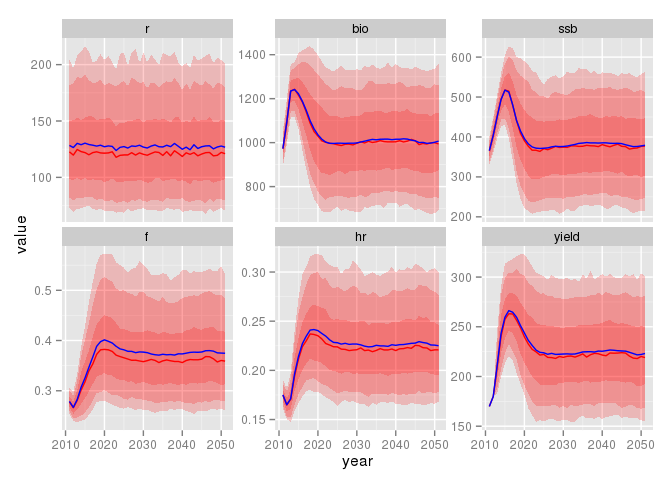

# HCR evaluation - short note

## Installing


```r
devtools::install_github("einarhjorleifsson/fpress2")
```

## A quick start

Here a quick overview is provided on how the functional routines are set up (besides the error structure). A HCR evaluation of the Icelandic cod is here taken as an example. The needed input files for that stock are available as part of the fpress package.

__Read in the control file__:


```r
library(fpress2)
file <-  paste(path.package("fpress2"),'extdata/hcr_iCod.ctr',sep='/')
ctr <- hcr_read_ctr(file)
print(readLines(file),include.rownames=FALSE)
```

```
 [1] "## Conrol file for Icelandic cod"                                          
 [2] "0    # a1 - first age"                                                     
 [3] "14   # a2 - last (plus group) age"                                         
 [4] "2011 # y1 - first year of simulation (normally the assessment year)"       
 [5] "2051 # y2 - last year of simulation"                                       
 [6] "1000 # iter - numer of iterations (usually something larger than 999)"     
 [7] "5    # f1 - lower age in fishing mortality calculation"                    
 [8] "10   # f2 - upper age in fishing mortality calculation"                    
 [9] "1    # nR - number age classes with unknown recruits"                      
[10] "170  # tac_y1 - the TAC in the advisory year [check this]"                 
[11] "180  # tac_y2 - the TAC in the year following the advisory year [and this]"
[12] "1    # y1Bias - Stock assessment bias in the first year"                   
[13] "0.32 # r_cv - recruitment cv"                                              
[14] "0.00 # r_rho - recruitment autocorrelation"                                
[15] "1    # r_model - recruitment model"                                        
[16] "128  # r_mean parameter in the ssb-r function"                             
[17] "220  # ssb_break parameter in teh ssb-r function"                          
[18] "0.15 # a_cv assessment cv"                                                 
[19] "0.45 # a_rho assessment autocorrelation"                                   
[20] "1    # a_error assessment error type"                                      
[21] "1    # a_bias bias in the assessment"                                      
[22] "0.15 # w_cv weight cv"                                                     
[23] "0.60 # w_rho weight autocorrelation"                                       
[24] "2    # w_error weight error type"                                          
[25] "1    # w_refB weights used in the reference biomass"                       
[26] "0.5  # h_alfa buffer in the hcr rule"                                      
[27] "1    # b_trigger trigger in the hcr rule"                                  
[28] "0    # delay 0 if tac-decision based on numbers in the assessment year"    
[29] "3    # h_number hcr model number"                                          
[30] "1    # i_number Implementation model number"                               
[31] "0.0000000001 # b1 beta1 in the implemation error"                          
[32] "1    # b2 in the implementation error"                                     
```

__Set the sweep of management harvest rate vectors__:

```r
HRATE <- c(0.00001, seq(0.05,0.40,by=0.01))
ctr$HRATE <- HRATE
```

__A quick fix for now__: Should really be read from input file

```r
ctr$w_cv <- rep(0.05,15) 
```

__Set up the structure__: Creates a long list of array objects stored in an object (list) here named monsterStructure. This contains the nuts and bolts of any HCR evaluation. Setting up the dimensions of final object size means considarably less strain on R.

on ToDo-list: document further
  

```r
monsterStructure <- hcr_set_dimensions(ctr)
```

Read in the starting year information (details also on the documentation ToDo-list) and pass it, the control file data and the monster structure to `hcr_starting_conditions` function wich will set up a an object in the workspace (working name X) containg needed information for the stock in question to start the HCR-evaluation (also on the documentation ToDo-list).


```r
file  <-  paste(path.package("fpress2"),"extdata/hcr_iCod.dat",sep="/")
dat <- hcr_read_startfile(file)
hcr_set_starting_conditions(dat, monsterStructure, ctr)
```

__Seed the first year__: Here we start the actual evaluation by inititialize the first year. One should think of this as the assessment year (current year). The way that the hcr-evaluation is set up is that the TAC has already been set for the assessment year (effectively set last year based on last years assessment).

* Given that the TAC in the current year was based on last years assessment that of course includes observation error we need to calculate the realized harvest rate that is assiciated with that decision. We hence start by estimating the mortality multiplier that is associated with the set TAC. This is done using the `hcr_TAC_to_Fmult` function:
* In the second step we apply the realized mortality to the true stock in numbers. This is often referred to as the operating model, called by the `hcr_operating_mode` function:

Within the operating model resides a recruitment model to estimate incoming recruits (age 0) in the assessment year. Once the stock in numbers of age zero numbers are available the population is carried though to the end of the year based on the conventional stock equation. On the programming To-Do list is to implement this through the switch function.


```r
y <- 1
for (h in 1:length(HRATE)) {
  Fmult <- hcr_TAC_to_Fmult(y,h)
  hcr_operating_model(y, h, ctr, Fmult, nR=1)
}
```

__The main loop__: Starting in the second year. Which one can think of as the current assessment year.  What is done in the fpress framework is to run all the iterations within a year in one sweep. I.e. we do not have a for-loop for the iteration, only the harvest rate (could be changed in the future). Hence we loop through each management decision mortality within the first year. This is actually what is done in all consequitve steps.

Modelling implementation error is done in the first step. This model is something that is mentioned in the Bible's but rarely used. In principle the actual removals in forms of catch are set differently than that dictated in the actual HCR. If that is the case one really should question if it is worth while doing a HCR evaluation at all.
  
Whatever the case, here a space suggested in the script for adding implementation error model. Here one makes use the switch function of R-base to control the implementation model being run. More on that later. As of now the the `hcr_implementation_model_1` is set in the first slot as a dummy.

The second step is the same as used in the first year, i.e. calculation of the realized mortality multiplier relative to the TAC that was set (done last year) using the `hcr_TAC_to_Fmult` function.
  
The third step, the operating model has also been mentioned, i.e. the `hcr_operating_model` function

In the fourth step, often referred to as the observation model one adds an error term to the true observation value. This may be any index one can think of to base decision on, such as mortality signals, survey indices, rate of changes etc. Here we have only set up observation error model for Fmort, spwaning stock biomass and reference biomass, this being called by the function `hcr_observation_error`. More on this later in the document (documentation ToDo-list and using switch on the programming ToDo-list).

The decision model actually contains the HCR rule. Here the decision rule on next years TAC is (or whatever other management measure used to put some contraint on fishing mortality) is implemented. Of course based on the values from the observation model.

A space for a rule that is not implemented. This space is left for those that think one can hit the target F each and every year. So awaits some ingenuity ...

The conventional ICES F-based rules, by function `hcr_management_fmort` (not implemented yet):

The conventional Icelandic biomass-based rules, by function `hcr_management_bio`.

Here one could then add any additional observation model, e.g. survey biomass index, etc.

The code may look something like this:

```r
for (h in 1:length(HRATE)) {
  for(y in 2:(ctr$y2 - ctr$y1)) {
    
    switch(ctr$i_number,
           dummy <- hcr_implementation_model_1(),
           stop("implementation model 2 is available for developement"),
           stop(" and whatever more ..."))
    
    Fmult <- hcr_TAC_to_Fmult(y, h)
    
    hcr_operating_model(y, h, ctr, Fmult, nR=1)

    hat <- hcr_observation_error(y,h,Fmult,ctr)

    switch(ctr$h_number,
           stop("Not implemented year"),
           stop("hcr_management_fmort(hat$,hat$ssb,ctr)"),
           hcr_management_bio(y,h,hat$bio,hat$ssb,ctr))
    
  }
}
```

Now update the final year. Here we only do the same as the first year, i.e. calculate the stock in numbers to the end of the final year in the simulation.


```r
y <- ctr$y2 - ctr$y1 + 1 
for (h in 1:length(HRATE)) {
  Fmult <- hcr_TAC_to_Fmult(y,h)
  hcr_operating_model(y, h, ctr, Fmult, nR=1)
}
```

The result data for now resides in an object in the working directory called (for now) X. This is a list containing arrays of various elements. To just obtain estimates of catches one can simply do:


```r
dat <- hcr_summarise_data(X,ctr)
head(dat)
```

```
##   year iter target         r       bio       ssb           f          hr
## 1 2011    1  1e-05 168.82693  976.0461  367.2564 0.276830505 0.174120501
## 2 2012    1  1e-05 142.05473 1146.1236  426.7638 0.252061869 0.156998900
## 3 2013    1  1e-05  89.67864 1326.2512  526.4838 0.103201440 0.067804126
## 4 2014    1  1e-05 165.80999 1513.5953  715.4180 0.039716563 0.029664268
## 5 2015    1  1e-05  92.97601 1810.1885  954.5963 0.015602114 0.012357487
## 6 2016    1  1e-05  86.07112 2011.9112 1173.1321 0.006616924 0.005515067
##       yield
## 1 169.94964
## 2 179.94015
## 3  89.92530
## 4  44.89970
## 5  22.36938
## 6  11.09583
```


```r
i <- dat$target %in% c(0.22)
d <- reshape2::melt(dat[i,],c("year","iter","target"))
library(ggplot2)
ggplot(d,aes(year,value)) + 
  stat_summary(fun.data = fishvise::i90, fill = "red", geom="ribbon", alpha=0.2) +
  stat_summary(fun.data = fishvise::i80, fill = "red", geom="ribbon", alpha=0.2) +
  stat_summary(fun.data = fishvise::i50, fill = "red", geom="ribbon", alpha=0.2) +
  stat_summary(fun.y = median, colour = "red", geom="line") +
  stat_summary(fun.y = mean, colour = "blue", geom="line") +
  facet_wrap( ~ variable, scale="free_y")
```

 


```r
i <- dat$target %in% c(0.25)
d <- reshape2::melt(dat[i,],c("year","iter","target"))
ggplot(d,aes(year,value)) + 
  stat_summary(fun.data = fishvise::i90, fill = "red", geom="ribbon", alpha=0.2) +
  stat_summary(fun.data = fishvise::i80, fill = "red", geom="ribbon", alpha=0.2) +
  stat_summary(fun.data = fishvise::i50, fill = "red", geom="ribbon", alpha=0.2) +
  stat_summary(fun.y = median, colour = "red", geom="line") +
  stat_summary(fun.y = mean, colour = "blue", geom="line") +
  facet_wrap( ~ variable, scale="free_y")
```

 

Lets stop for now with this. In the next two pages some plots are provided of output based on the exactly the code above.


And out of this one can plot the illusive MSY (details provided later) and think about the appropriate fishing mortality to be used in the advisory context:

```r
ggplot(dat[dat$year %in% 2040:2049,],aes(target,yield)) + 
  stat_summary(fun.data = fishvise::i90, fill = "red", geom="ribbon", alpha=0.2) +
  stat_summary(fun.data = fishvise::i80, fill = "red", geom="ribbon", alpha=0.2) +
  stat_summary(fun.data = fishvise::i50, fill = "red", geom="ribbon", alpha=0.2) +
  stat_summary(fun.y = median, colour = "red", geom="line") +
  stat_summary(fun.y = mean, colour = "blue", geom="line")
```

 

If one is concerned with the 5th percentile vs some biomass reference value one has SSB profile:


```r
ggplot(dat[dat$year %in% 2040:2049,],aes(target,ssb)) + 
  stat_summary(fun.data = fishvise::i90, fill = "red", geom="ribbon", alpha=0.2) +
  stat_summary(fun.data = fishvise::i80, fill = "red", geom="ribbon", alpha=0.2) +
  stat_summary(fun.data = fishvise::i50, fill = "red", geom="ribbon", alpha=0.2) +
  stat_summary(fun.y = median, colour = "red", geom="line") +
  stat_summary(fun.y = mean, colour = "blue", geom="line") +
  geom_hline(yintercept = 220)
```

 

\section{On coding error structures}

In the current version error structures are only available for recruitement, weights at age and assessment error. For those, the error structure can be either normal og lognormal. All provide a switch option to include autocorrelation, something that one should consider as default for all stocks unless proven to be of pure random nature.

Since no stock dependency is assumed/allowed in the current version all the error structure can be set up in the initialization process. The following example illustrates how the error code is set up in the fpress code, an example were the


```r
n_years  <- 50
cv <- 0.15
rho <- 0.60

x1 <- rnorm(n_years)
x2 <- x1
for (y in 2:n_years) {
  x2[y] <- rho * x2[y-1] + sqrt(1 - rho^2) * x2[y]
}
x1 <- x1 * cv
x2 <- x2 * cv

cW <- rep(6,n_years)
d <- data.frame(Year=c(1:n_years),
                whiteW = cW * (1 + x1),
                autocW = cW * (1 + x2))
d2 <- melt(d,id.vars="Year")
ggplot(d2,aes(Year,value,colour=variable)) + geom_point() + geom_line() +
  geom_hline(yintercept=cW) + scale_colour_brewer(palette="Set1")
```
